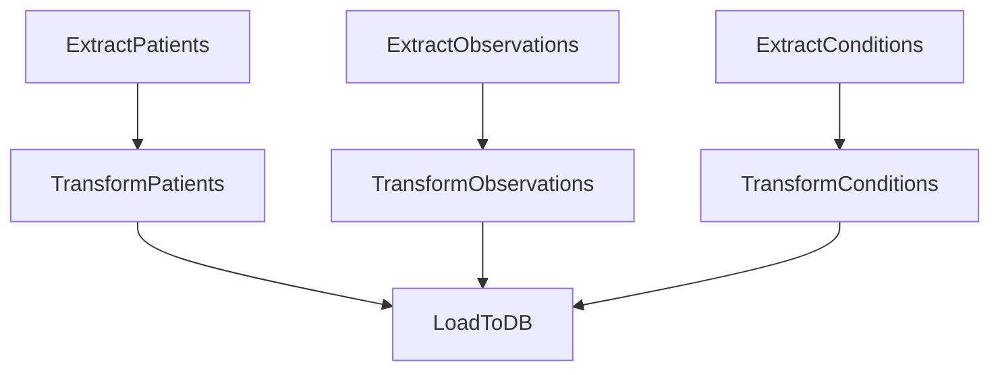

# Healthcare ETL Pipeline with Apache Airflow

This project implements a complete **ETL** (Extract, Transform, Load) pipeline to process structured healthcare data from a **FHIR API** (running locally via HAPI FHIR in Docker), transform it into clean tabular formats, and load it into a **PostgreSQL** database for analysis. The pipeline is orchestrated with **Apache Airflow**, running inside Docker containers.


## 🔄 ETL Flow Overview

```text
FHIR API (Docker) ──> Airflow ──> Raw JSON ──> Transformed CSV ──> PostgreSQL
```

## 💡 Components:
**Extract:** Pulls FHIR data (Patients, Observations, Conditions) from a HAPI FHIR server.

**Transform:** Cleans, flattens, and normalizes JSON data into tabular form (CSV).

**Load:** Inserts structured data into PostgreSQL tables (patients, observations, conditions).

**Orchestration:** Apache Airflow DAG defines and manages task dependencies.

**Environment:** Fully containerized with Docker Compose.

## 📦 Technologies Used

- [Apache Airflow](https://airflow.apache.org/)
- [Docker](https://www.docker.com/)
- [PostgreSQL](https://www.postgresql.org/)
- Python (pandas, psycopg2, sqlalchemy)


## 🔧 FHIR Resources Processed
- Patients

- Observations (heart rate, blood pressure, body tempreture)

- Conditions

## 🧠 DAG Execution Flow


## ⚙️ Setup Instructions

### 1. Clone the Repository

```bash
git clone https://github.com/abdelmaoulagr/Healthcare_ETL.git
cd Healthcare_ETL
```

### 2. Create a Virtual Environment 

```bash
python3 -m venv venv
source venv/bin/activate
```
### 3. Install the Dependencies
```bash
pip install -r requirements.txt
```
### 4. Start Docker Containers

Make sure Docker and Docker Compose are installed.

```bash
docker-compose up --build
```
### 5. Access Airflow
- Airflow Webserver: http://localhost:8080

    - Default credentials: `airflow / airflow`

### 6. Trigger the DAG
- Go to the Airflow UI

- Turn on and trigger the `healthcare_etl_pipeline` DAG

## 📌 Notes
- Airflow task logs provide full traceability.

- Extracted JSON files are saved in `/data/raw/`, and processed CSVs in `/data/processed/`.

- Duplicate handling is implemented using SQL `ON CONFLICT DO NOTHING`.